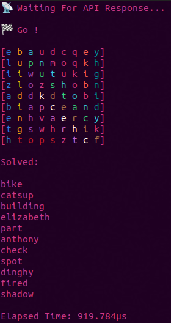

# WordSearch Solver



## Overview

WordSearch Solver is a Go application designed to solve word search puzzles efficiently. It fetches a word search puzzle from an API and then searches for words in multiple directions. When a word is found, it highlights it in the grid using ANSI color codes.

## Features

- Fetches word search puzzles from an API.
- Searches for words in all eight directions:
  - Right
  - Left
  - Down
  - Up
  - Upper-right
  - Upper-left
  - Lower-right
  - Lower-left
- Highlights found words using ANSI color codes.
- Displays the grid and found words.

## Installation

To run the WordSearch Solver, you need to have Go installed on your machine. Follow these steps to install and run the application:

1. Clone the repository:

   ```sh
   git clone https://github.com/L-A-Marchetti/Wordsearch-solver.git
   cd SearchWordSolver
   ```

2. Build the application:

   ```sh
   go build -o searchwordsolver
   ```

3. Run the application:

   ```sh
   ./searchwordsolver
   ```

## Usage

When you run the application, it will:

1. Fetch a word search puzzle from the specified API.
2. Search for words in all specified directions.
3. Highlight found words and display the updated grid.

## License

This project is licensed under the MIT License.

---